# Borneo Indobara - Truck Tracking & Fleet Management System

A comprehensive web-based fleet management and real-time truck tracking system for PT Borneo Indobara. This application provides live vehicle tracking, tire pressure monitoring (TPMS), fuel monitoring, temperature monitoring, and complete fleet management capabilities.

## Deskripsi Proyek

Borneo Indobara Truck Tracking System adalah platform manajemen armada yang dirancang khusus untuk industri pertambangan dan transportasi. Sistem ini menyediakan:

- **Real-time Tracking**: Pelacakan posisi kendaraan secara langsung menggunakan GPS
- **TPMS Integration**: Monitoring tekanan ban dan suhu ban secara real-time
- **Fleet Management**: Manajemen lengkap data kendaraan, driver, sensor, dan perangkat IoT
- **Historical Tracking**: Riwayat perjalanan kendaraan dengan replay tracking
- **Monitoring Dashboard**: Dashboard interaktif dengan visualisasi data dan statistik
- **Alert System**: Sistem notifikasi untuk anomali dan peringatan kendaraan
- **Multi-vendor Support**: Dukungan untuk multiple vendor dan grup armada

## Fitur Utama

### Live Tracking
- Peta real-time dengan marker kendaraan
- Status kendaraan (aktif/idle/nonaktif)
- Informasi detail kendaraan (driver, kecepatan, lokasi)
- WebSocket integration untuk update real-time
- Cluster markers untuk multiple vehicles

### Monitoring System
- **Tire Pressure Monitoring**: Monitor tekanan dan suhu 10 ban per kendaraan
- **Fuel Monitoring**: Tracking konsumsi bahan bakar
- **Temperature Monitoring**: Monitor suhu kendaraan
- **Device Status**: Status koneksi dan kesehatan perangkat IoT

### Fleet Management
- **Vehicles (Trucks)**: CRUD lengkap untuk data kendaraan
- **Drivers**: Manajemen data driver dengan lisensi
- **Sensors (TPMS)**: Konfigurasi sensor ban per kendaraan
- **Devices**: Manajemen perangkat IoT dan GPS
- **Vendors**: Manajemen vendor dan kontraktor


## Teknologi yang Digunakan

### Frontend
- **React 19** - UI Library
- **React Router v7** - Navigation
- **Vite 7** - Build tool & dev server
- **Tailwind CSS v4** - Styling framework

### Maps & Tracking
- **Leaflet** - Interactive maps
- **React Leaflet** - React bindings for Leaflet
- **Leaflet Polyline Decorator** - Route decorations

### State Management & API
- **Axios** - HTTP client
- **Socket.io Client** - WebSocket communication
- **Custom hooks** - useAuth, useApi2, useAlert

### Developer Tools
- **ESLint** - Code linting
- **Prettier** - Code formatting
- **SWC** - Fast refresh

## Instalasi

### Prasyarat
Pastikan Anda telah menginstal:
- **Node.js** versi 22.18.0
- **npm** atau **yarn**
- **Git**

### Langkah Instalasi

1. **Clone repository**
   ```bash
   git clone https://github.com/JosinBahaswan/Truck-Tracking.git
   cd borneo-indobara
   ```

2. **Install dependencies**
   ```bash
   npm install
   ```
   atau
   ```bash
   yarn install
   ```

3. **Konfigurasi Environment**
   
   Buat file konfigurasi API di `src/services/management/config.js`:
   ```javascript
   export const API_CONFIG = {
     baseURL: 'http://your-backend-api-url',
     timeout: 10000,
   };
   ```

   Konfigurasi WebSocket di `src/services/management/websocket.js`:
   ```javascript
   export const WS_CONFIG = {
     url: 'ws://your-websocket-url',
   };
   ```

4. **Jalankan Development Server**
   ```bash
   npm run dev
   ```
   
   Aplikasi akan berjalan di `http://localhost:5173`

5. **Build untuk Production**
   ```bash
   npm run build
   ```
   
   File build akan tersimpan di folder `dist/`

6. **Preview Production Build**
   ```bash
   npm run preview
   ```

## 📁 Struktur Proyek

```
borneo-indobara/
├── public/                     # Static assets
├── src/
│   ├── components/            # Reusable components
│   │   ├── auth/             # Login components
│   │   ├── common/           # Common UI components
│   │   │   ├── DatePicker.jsx
│   │   │   ├── Button.jsx
│   │   │   ├── AlertModal.jsx
│   │   │   └── ...
│   │   ├── dashboard/        # Dashboard components
│   │   ├── layout/           # Layout components
│   │   └── icons/            # Custom icons
│   ├── pages/                # Page components
│   │   ├── Dashboard.jsx
│   │   ├── LiveTracking.jsx
│   │   ├── HistoryTracking.jsx
│   │   ├── form/             # Form pages
│   │   │   ├── TruckForm.jsx
│   │   │   ├── DriverForm.jsx
│   │   │   └── ...
│   │   ├── listdata/         # List pages
│   │   │   ├── TrucksList.jsx
│   │   │   ├── DriversList.jsx
│   │   │   └── ...
│   │   └── monitoring/       # Monitoring pages
│   ├── services/             # API services
│   │   ├── management/       # Backend 2 APIs
│   │   ├── tracking/         # Tracking APIs
│   │   └── websocket/        # WebSocket services
│   ├── hooks/                # Custom React hooks
│   │   ├── useAuth.js
│   │   ├── useApi2.js
│   │   └── useAlert.js
│   ├── routes/               # Route configuration
│   ├── App.jsx               # Main App component
│   └── main.jsx              # Entry point
├── package.json
├── vite.config.js
├── tailwind.config.js
└── README.md
```

## Screenshots

### Live Tracking
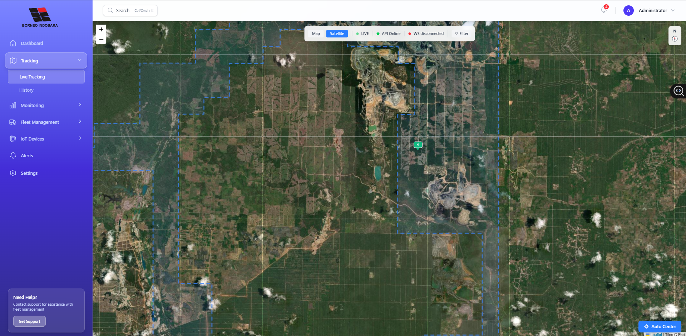
*Peta real-time tracking kendaraan dengan marker dan status monitoring*

### History Tracking
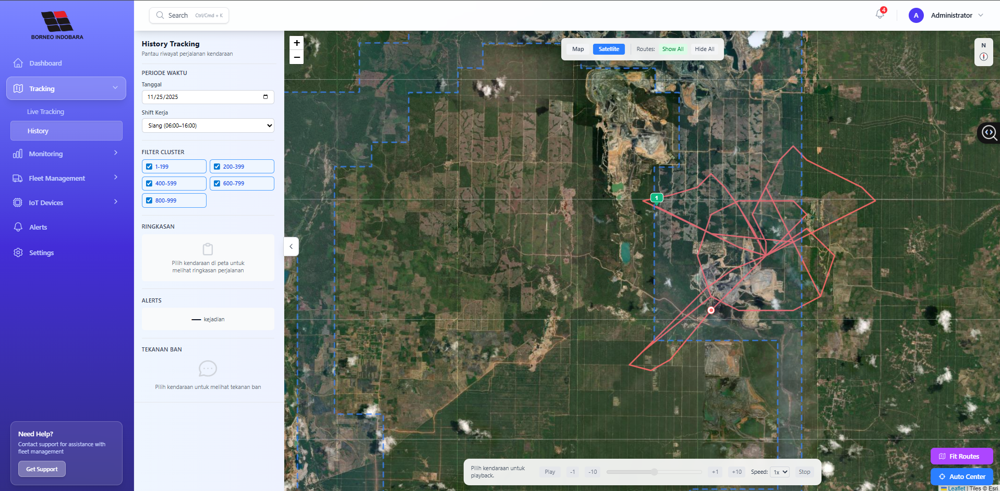
*Riwayat perjalanan kendaraan dengan data tracking lengkap*

---

### Fleet Management - List Data

#### Vehicles List
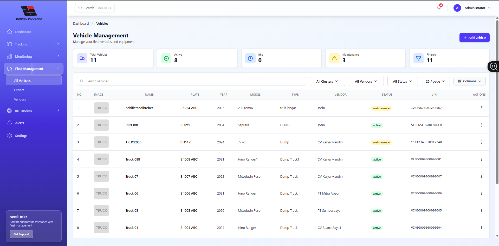
*Daftar kendaraan dengan informasi lengkap*

#### Drivers List
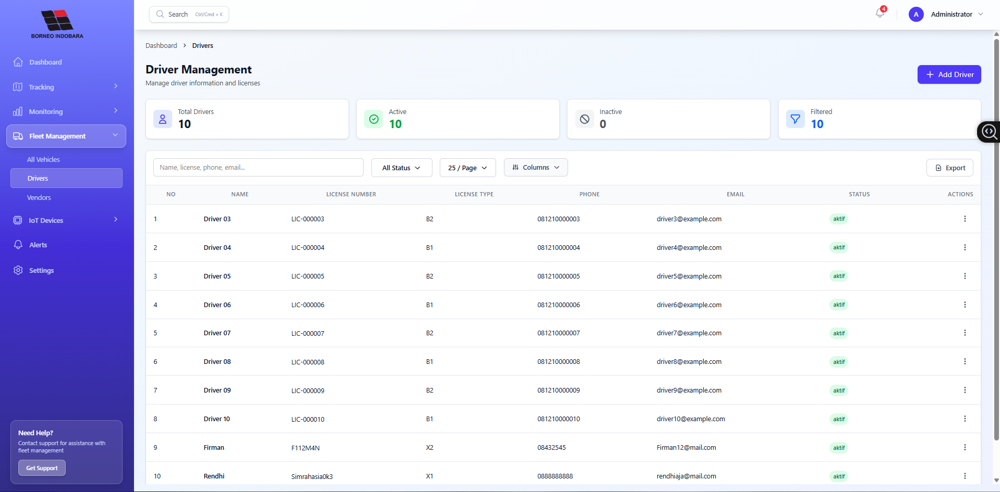
*Daftar pengemudi dengan data lisensi*

#### Sensors List
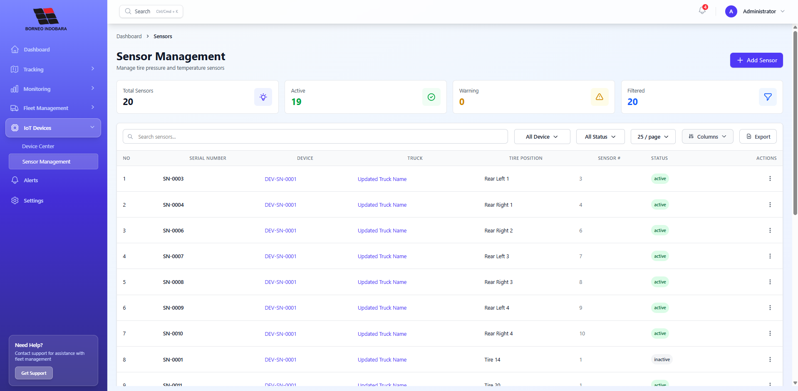
*Daftar sensor TPMS yang terpasang*

#### Devices List
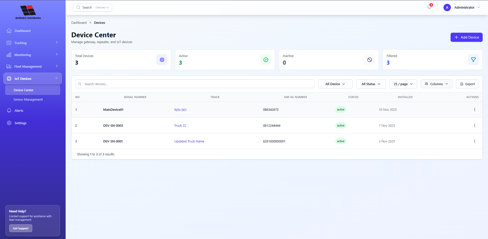
*Daftar perangkat IoT dan GPS tracker*

#### Vendors List
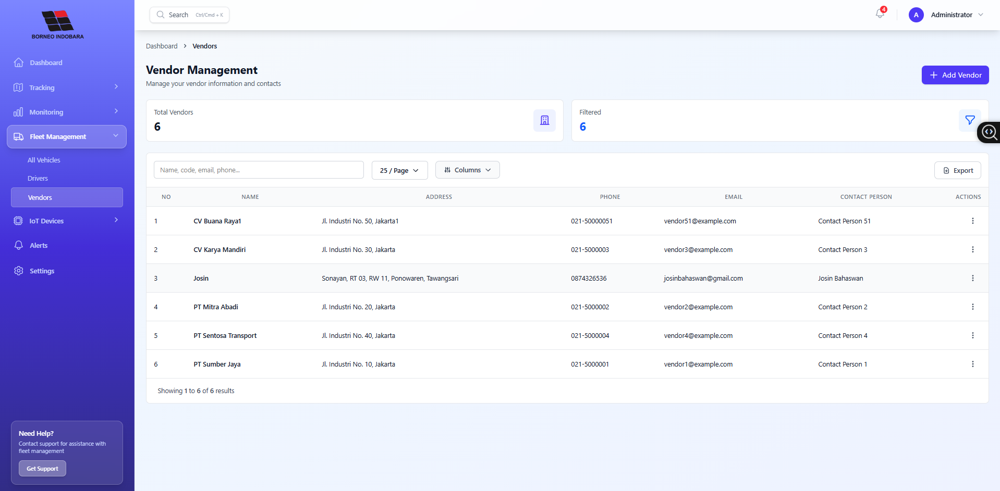
*Daftar vendor dan kontraktor*

---

### Forms - Create/Edit Data

#### Add New Vehicle
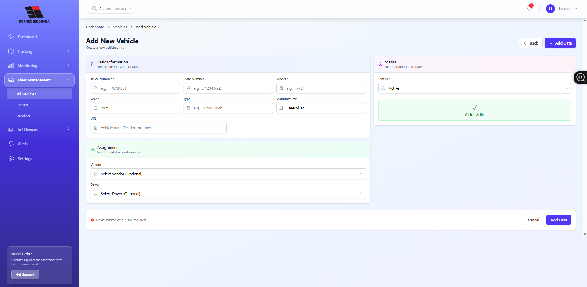
*Form input data kendaraan baru dengan DatePicker*

#### Add New Driver
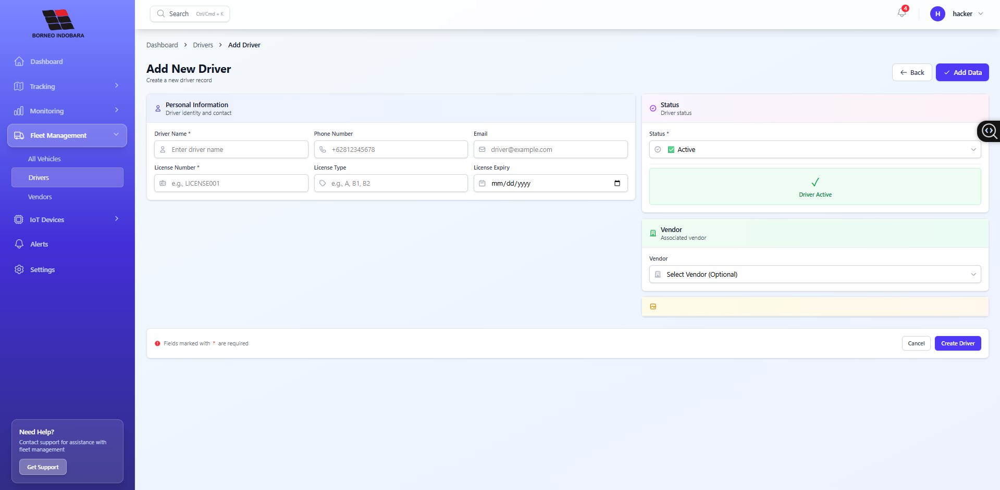
*Form input data pengemudi dengan informasi lisensi*

#### Add New Sensor
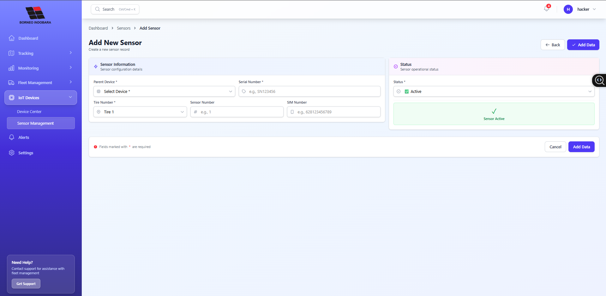
*Form konfigurasi sensor TPMS*

#### Add New Device
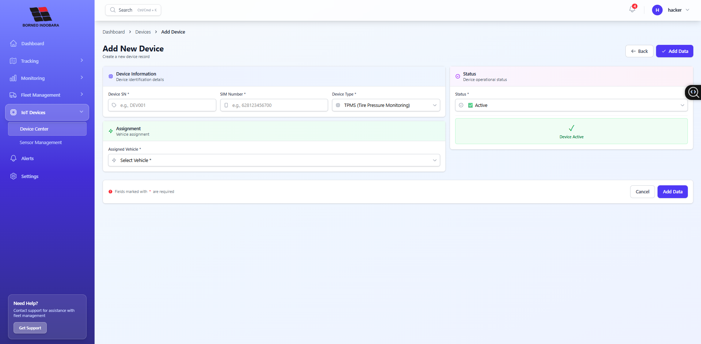
*Form registrasi perangkat IoT baru*

#### Add New Vendor
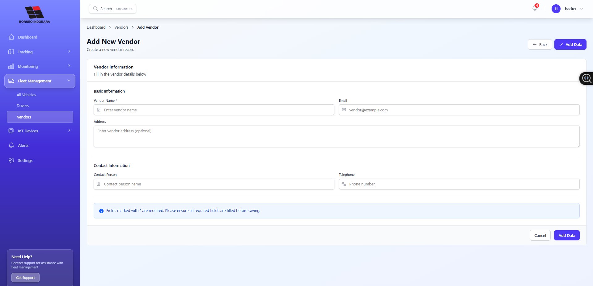
*Form registrasi vendor dan kontraktor*

